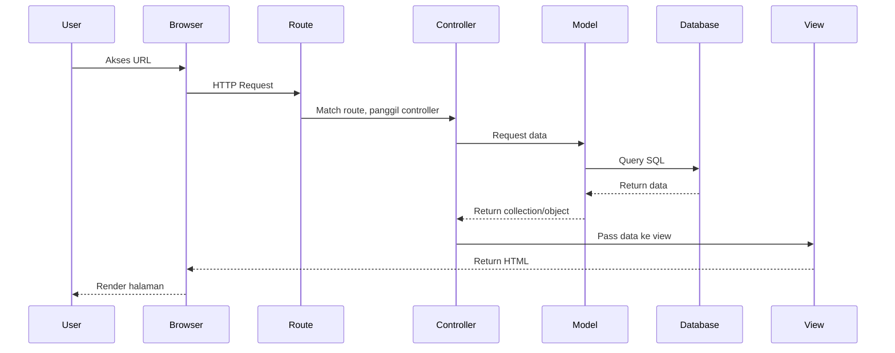
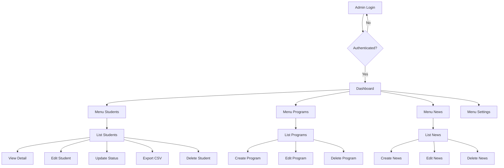
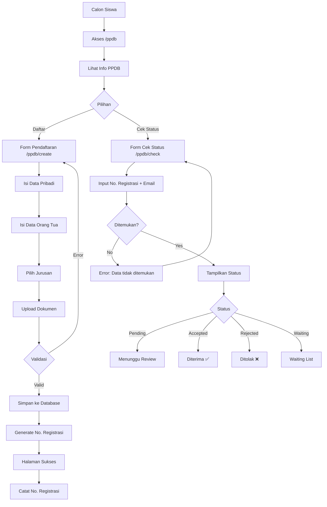

# 📚 Dokumentasi Lengkap Website SMK Metland School

Dokumentasi komprehensif tentang struktur, teknologi, dan cara kerja website ini.

---

## 📊 Ringkasan Project

| Item | Detail |
|------|--------|
| **Nama Website** | SMK Metland School |
| **Framework** | Laravel 12 |
| **Bahasa** | PHP 8.2 |
| **CSS Framework** | Tailwind CSS 4.1.18 |
| **JavaScript** | Alpine.js 3.15.8 |
| **Build Tool** | Vite 7.0.7 |
| **Total File** | 12,717 files |
| **Ukuran Total** | 200.5 MB |
| **Database** | MySQL/MariaDB |

---

## 🎨 Font yang Digunakan

### Primary Font
```css
font-family: 'Poppins', sans-serif;
```

**Poppins** digunakan sebagai font utama dengan weight:
- `300` - Light
- `400` - Regular  
- `500` - Medium
- `600` - Semi-bold
- `700` - Bold
- `800` - Extra-bold

### Cara Load Font
```html
<link href="https://fonts.googleapis.com/css2?family=Poppins:wght@300;400;500;600;700;800&display=swap" rel="stylesheet">
```

**Lokasi:** `resources/views/layouts/guest.blade.php`, navbar components

---

## 💻 Bahasa Pemrograman & Framework

### Backend: Laravel 12 + PHP 8.2

**Mengapa Laravel?**
1. **MVC Architecture** - Struktur kode terorganisir
2. **Eloquent ORM** - Database queries mudah dan aman
3. **Blade Templating** - Template engine yang powerful
4. **Built-in Security** - CSRF, XSS protection built-in
5. **Artisan CLI** - Command line untuk generate code
6. **Komunitas besar** - Dokumentasi lengkap

**Mengapa tidak Next.js/React?**
- Laravel lebih cocok untuk website sekolah yang butuh **Server-Side Rendering**
- Admin panel lebih mudah dengan Blade
- SEO lebih baik tanpa JavaScript-only rendering
- Hosting lebih murah (PHP hosting dimana-mana)

### Frontend: Tailwind CSS 4 + Alpine.js 3

**Mengapa Tailwind CSS?**
1. **Utility-first** - Class langsung di HTML, cepat development
2. **Responsive** - Prefix `md:`, `lg:` mudah digunakan
3. **Customizable** - Warna, spacing bisa dikustomisasi
4. **Tree-shaking** - CSS yang tidak dipakai tidak di-bundle

**Mengapa Alpine.js?**
1. **Lightweight** - Hanya ~15KB
2. **Reactive** - Mirip Vue.js tapi lebih ringan
3. **No Build Step** - Bisa langsung pakai di HTML
4. **Cocok untuk Laravel** - Tidak butuh SPA complexity

**Mengapa tidak React/Vue full?**
- Overkill untuk website sekolah
- SEO lebih susah dengan SPA
- Learning curve lebih tinggi
- Bundle size lebih besar

---

## 📁 Struktur Folder Project

```
lomba-ms/
├── app/                    # Core aplikasi
│   ├── Http/
│   │   ├── Controllers/    # Logic bisnis
│   │   │   ├── Admin/      # Controller untuk admin panel
│   │   │   └── *.php       # Controller public
│   │   └── Middleware/     # Request filtering
│   └── Models/             # Database models (Eloquent)
│
├── config/                 # Konfigurasi Laravel
├── database/
│   ├── migrations/         # Struktur tabel database
│   └── seeders/            # Data dummy/initial
│
├── public/                 # File yang bisa diakses publik
│   ├── image/              # Gambar statis
│   ├── js/                 # JavaScript (translations.js)
│   └── index.php           # Entry point
│
├── resources/
│   ├── css/                # Source CSS
│   ├── js/                 # Source JavaScript  
│   └── views/              # Blade templates
│       ├── admin/          # Halaman admin
│       ├── components/     # Reusable components
│       ├── layouts/        # Layout templates
│       ├── ppdb/           # Halaman PPDB
│       └── *.blade.php     # Halaman publik
│
├── routes/
│   └── web.php             # Definisi routes
│
└── storage/                # File uploads & cache
```

---

## 🔒 Sistem Keamanan

### Level Keamanan: ⭐⭐⭐⭐ (4/5 - Baik)

### Fitur Keamanan yang Sudah Ada:

#### 1. CSRF Protection
```php
// Otomatis di semua form
@csrf
```
Setiap form memiliki token CSRF untuk mencegah serangan Cross-Site Request Forgery.

#### 2. Input Validation
```php
// Contoh di PPDBController.php
$request->validate([
    'email' => 'required|email|unique:students,email',
    'phone' => 'required|string|max:20',
    // ...
]);
```

#### 3. SQL Injection Prevention
Laravel Eloquent menggunakan **prepared statements** secara otomatis:
```php
// AMAN - Eloquent
Student::where('email', $email)->first();

// BERBAHAYA - Raw query tanpa binding (TIDAK digunakan)
// DB::raw("SELECT * FROM students WHERE email = '$email'");
```

#### 4. XSS Prevention
Blade template otomatis escape HTML:
```php
// Output aman
{{ $student->name }}

// Output raw (hanya jika diperlukan)
{!! $trustedHtml !!}
```

#### 5. File Upload Security
```php
// Validasi tipe file
'photo' => 'nullable|image|mimes:jpeg,png,jpg|max:2048',
'certificate' => 'nullable|file|mimes:pdf,jpeg,png,jpg|max:5120',
```

#### 6. Authentication (Laravel Breeze)
- Password hashing dengan bcrypt
- Session management
- Remember me token

### Yang Bisa Ditingkatkan:
1. **Rate Limiting** - Belum ada di form PPDB
2. **Two-Factor Authentication** - Belum diimplementasi
3. **Email Verification** - Opsional
4. **Captcha** - Bisa ditambahkan di form pendaftaran

---

## 🔄 Alur Kerja Website

### Alur Request-Response



---

## 👨‍💼 Sistem Admin Panel

### Fitur Admin

| Menu | Deskripsi | Controller |
|------|-----------|------------|
| Dashboard | Statistik overview | `DashboardController` |
| Students | Kelola pendaftar PPDB | `StudentController` |
| Programs | Kelola program keahlian | `ProgramController` |
| News | Kelola berita | `NewsController` |
| Organizations | Kelola organisasi | `OrganizationController` |
| Extracurriculars | Kelola eskul | `ExtracurricularController` |
| Alumni | Kelola alumni | `AlumniController` |
| Settings | Pengaturan website | `WebsiteSettingController` |

### Flowchart Admin Panel



---

## 📝 Sistem PPDB (Penerimaan Peserta Didik Baru)

### Flowchart PPDB



### Alur Data PPDB

```
1. User mengisi form → PPDBController@create
2. Submit form → PPDBController@store
3. Validasi data → Laravel Validation Rules
4. Upload file → Storage::store()
5. Generate nomor registrasi → Student::boot()
6. Simpan ke database → Student::create()
7. Redirect ke halaman sukses → ppdb.success
```

---

## 📦 Contoh Kode CRUD (Create, Read, Update, Delete)

### Model: Student.php
**Lokasi:** `app/Models/Student.php`

```php
<?php
namespace App\Models;

use Illuminate\Database\Eloquent\Model;

class Student extends Model
{
    // Field yang boleh diisi mass-assignment
    protected $fillable = [
        'registration_number', 'full_name', 'email', 'phone',
        'gender', 'birth_date', 'birth_place', 'address',
        'parent_name', 'parent_phone', 'parent_job',
        'school_origin', 'average_grade', 'program_id',
        'registration_type', 'status', 'photo', 'certificate',
        'transcript', 'notes', 'registered_at'
    ];

    // Auto-cast field ke tipe tertentu
    protected $casts = [
        'birth_date' => 'date',
        'registered_at' => 'datetime',
    ];

    // Relasi ke tabel programs
    public function program()
    {
        return $this->belongsTo(Program::class);
    }

    // Auto-generate registration number
    protected static function boot()
    {
        parent::boot();
        
        static::creating(function ($student) {
            $year = date('Y');
            $count = static::whereYear('created_at', $year)->count() + 1;
            $student->registration_number = $year . str_pad($count, 4, '0', STR_PAD_LEFT);
        });
    }
}
```

### Controller: StudentController.php (Admin)
**Lokasi:** `app/Http/Controllers/Admin/StudentController.php`

#### CREATE (Melalui PPDB, bukan admin)
```php
// Di PPDBController.php
public function store(Request $request)
{
    // 1. Validasi input
    $request->validate([...]);
    
    // 2. Siapkan data
    $data = $request->all();
    $data['status'] = 'pending';
    
    // 3. Upload file jika ada
    if ($request->hasFile('photo')) {
        $data['photo'] = $request->file('photo')->store('students/photos', 'public');
    }
    
    // 4. Simpan ke database
    $student = Student::create($data);
    
    // 5. Redirect dengan pesan sukses
    return redirect()->route('ppdb.success', $student->registration_number);
}
```

#### READ (Index & Show)
```php
// List semua students dengan filter
public function index(Request $request)
{
    $query = Student::with('program'); // Eager loading

    // Filter by status
    if ($request->filled('status')) {
        $query->where('status', $request->status);
    }

    // Search
    if ($request->filled('search')) {
        $query->where('full_name', 'like', "%{$request->search}%");
    }

    $students = $query->latest()->paginate(15);
    return view('admin.students.index', compact('students'));
}

// Detail satu student
public function show(Student $student) // Route Model Binding
{
    return view('admin.students.show', compact('student'));
}
```

#### UPDATE
```php
public function update(Request $request, Student $student)
{
    // 1. Validasi
    $request->validate([
        'full_name' => 'required|string|max:255',
        'email' => 'required|email|unique:students,email,' . $student->id,
        // ...
    ]);

    // 2. Update data
    $student->update($request->all());

    // 3. Redirect dengan pesan
    return redirect()->route('admin.students.index')
        ->with('success', 'Student updated successfully.');
}
```

#### DELETE
```php
public function destroy(Student $student)
{
    // 1. Hapus file terkait
    if ($student->photo) {
        Storage::delete($student->photo);
    }

    // 2. Hapus dari database
    $student->delete();

    // 3. Redirect
    return redirect()->route('admin.students.index')
        ->with('success', 'Student deleted successfully.');
}
```

### Routes
**Lokasi:** `routes/web.php`

```php
// Routes untuk admin (dilindungi middleware auth)
Route::middleware(['auth'])->prefix('admin')->group(function () {
    Route::get('/dashboard', [DashboardController::class, 'index']);
    Route::resource('students', StudentController::class);
    Route::patch('students/{student}/status', [StudentController::class, 'updateStatus']);
});

// Routes untuk PPDB (public)
Route::get('/ppdb', [PPDBController::class, 'index']);
Route::get('/ppdb/create', [PPDBController::class, 'create']);
Route::post('/ppdb', [PPDBController::class, 'store']);
Route::get('/ppdb/success/{registration}', [PPDBController::class, 'success']);
Route::get('/ppdb/check', [PPDBController::class, 'check']);
Route::post('/ppdb/status', [PPDBController::class, 'status']);
```

---

## 🌐 Sistem Terjemahan (Internationalization)

### Cara Kerja

1. **translations.js** menyimpan semua teks dalam 2 bahasa
2. **Alpine.js Store** mengelola state bahasa aktif
3. **x-text directive** menampilkan teks sesuai bahasa

**Lokasi:** `public/js/translations.js`

```javascript
document.addEventListener('alpine:init', () => {
    Alpine.store('lang', {
        current: localStorage.getItem('lang') || 'id',
        
        translations: {
            nav_home: { id: 'Beranda', en: 'Home' },
            nav_about: { id: 'Tentang Sekolah', en: 'About School' },
            // ...
        },
        
        t(key) {
            return this.translations[key]?.[this.current] || key;
        },
        
        toggle() {
            this.current = this.current === 'id' ? 'en' : 'id';
            localStorage.setItem('lang', this.current);
        }
    });
});
```

**Penggunaan di Blade:**
```html
<span x-text="$store.lang.t('nav_home')">Beranda</span>
```

---

## ✅ Kelebihan Website

1. **Mobile Responsive** - Tampilan optimal di semua device
2. **Bilingual** - Mendukung Indonesia & English
3. **Modern UI** - Design premium dengan animasi smooth
4. **SEO Friendly** - Server-side rendering, meta tags lengkap
5. **Fast Loading** - Vite untuk bundling optimal
6. **Secure** - Laravel security features built-in
7. **Admin Panel** - Fitur CRUD lengkap untuk semua konten
8. **PPDB Online** - Sistem pendaftaran siswa baru online

## ❌ Kekurangan Website

1. **No Email Notification** - Belum ada notifikasi email untuk PPDB
2. **No Captcha** - Form rentan spam bot
3. **No 2FA** - Keamanan login masih basic
4. **No PWA** - Belum support offline/install
5. **No Image Optimization** - Gambar belum auto-compress
6. **No Caching** - Belum ada Redis/caching strategy

---

## 🗺️ Lokasi File Penting untuk Dipelajari

| Tujuan | File |
|--------|------|
| Belajar Blade | `resources/views/ppdb/create.blade.php` |
| Belajar Controller | `app/Http/Controllers/PPDBController.php` |
| Belajar Model | `app/Models/Student.php` |
| Belajar Routes | `routes/web.php` |
| Belajar Validasi | `app/Http/Controllers/Admin/StudentController.php` |
| Belajar Tailwind | `resources/views/components/navbar.blade.php` |
| Belajar Alpine.js | `public/js/translations.js` |
| Belajar Admin CRUD | `app/Http/Controllers/Admin/` (semua file) |

---

## 🚀 Cara Menjalankan Project

```bash
# 1. Clone & Install dependencies
composer install
npm install

# 2. Setup environment
cp .env.example .env
php artisan key:generate

# 3. Setup database (edit .env dulu)
php artisan migrate
php artisan db:seed

# 4. Link storage
php artisan storage:link

# 5. Jalankan development server
php artisan serve   # Backend: http://127.0.0.1:8000
npm run dev         # Frontend: Vite hot reload
```

---

*Dokumentasi ini dibuat untuk membantu memahami keseluruhan struktur dan cara kerja website SMK Metland School.*
